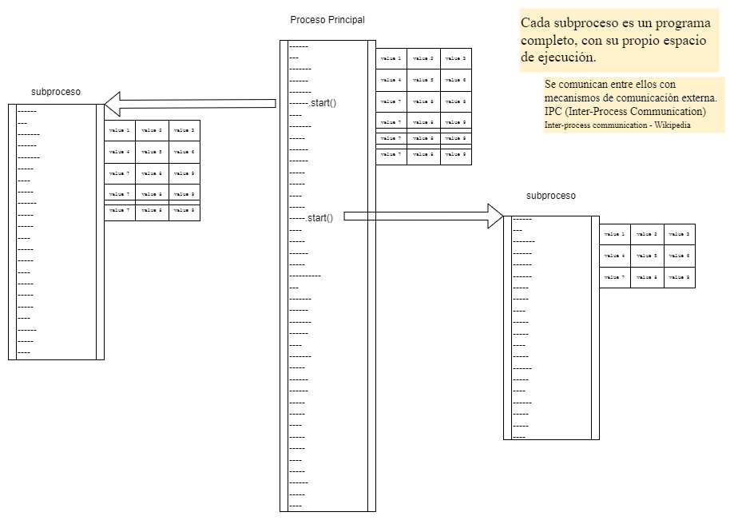
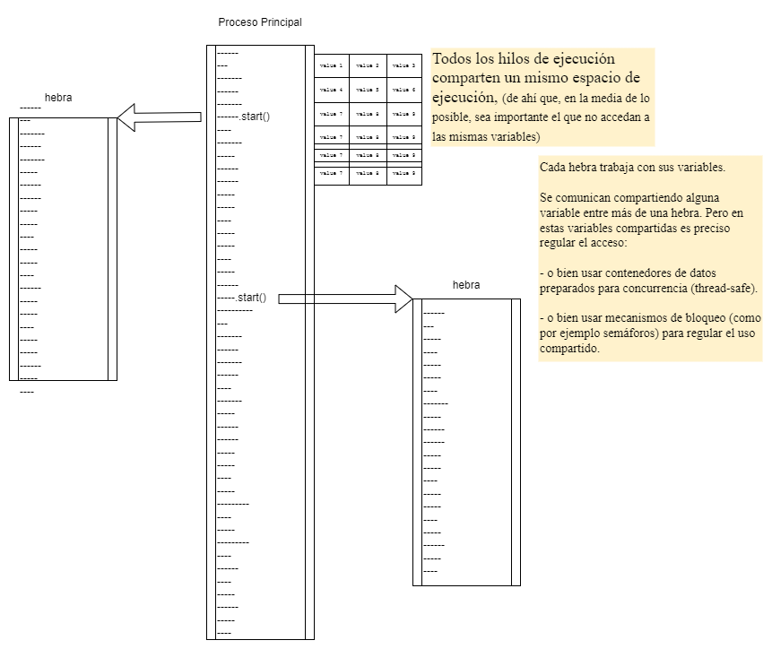

# Concurrente, Paralelo, Distribuido

- **Secuencial**  : diferentes tareas realizándose una a continuación de otra; una tarea no comienza hasta que haya terminado la anterior.

- **Concurrente** : diferentes tareas realizándose en momentos temporales que se pueden solapar.

- **Paralelo** : diferentes tareas realizándose simultáneamente.

- **Distribuido** : diferentes tareas realizándose en distintas máquinas (o en distintos programas).

Realizando tareas de forma secuencial, la relación entre tareas es clara y es fácil seguir el flujo de ejecución.

Realizando tareas de forma concurrente, paralela o distribuida, nunca hay ninguna garantia acerca del orden en que vayan a ejecutarse; es necesario tener siempre en cuenta todas las posibilidades de interacción entre tareas. 

Cuanto menos relación tengan las distintas tareas entre sí, más fácil será seguir el flujo de ejecución . Y viceversa, más complicaciones habrá cuanto más dependencias tengan unas tareas con otras. Por tanto, el objetivo principal es organizar los trabajo de forma que cada tarea sea lo más independiente posible.

## Algunas consideraciones teóricas

### Paralelizable , Concurrentizable

Si un trabajo se puede hacer a trozos autónomos ==> es paralelizable.

- ¿Cuántos trabajadores tenemos? -> n

- Dividir la tarea en n trozos independientes.

- Recoger los n resultados parciales y combinarlos.

Si un trabajo tiene varias tareas (más o menos) independientes ==> es concurrentizable.

- Asignar un trabajador para cada tarea.

- Determinar los puntos de intersección.

- Establecer los mecanismos adecuados de comunicación/coordinación.

### Intercambio de datos entre hilos de ejecución

Como regla general:

- A la hora de **leer**, no hay ninguna limitación; multiples hilos pueden estar leyendo un mismo recurso a la vez. 

  Aunque, ¡ojo!, tener siempre en cuenta que:

  - Si se va a trabajar sobre la información que se ha leido. Una escritura posterior de otro hilo puede invalidar esa información.

  - Si se está leyendo una información a trozos, cuidar que no haya posibilidad de que otro hilo modifique algo entre lectura de un trozo y de otro. De todas formas, con datos compuestos, mejor hacer toda la lectura de un golpe (en una sola operación atómica).

- A la hora de **escribir**, cada hilo que vaya a modificar algo lo ha de hacer en una sola operación atómica:
   1. Ha de reservarse (bloquear) el recurso a modificar.
   2. Realiza las operaciones de lectura/escritura/modificación que precise.
   3. Ha de liberar (desbloquear) el recurso.

  Durante el tiempo de bloqueo, ningún otro hilo puede usar ese recurso para nada.

### Coordinación entre hilos de ejecución

Algunos consejos:

- Modelar correctamente los límites de uso de los recursos compartidos. Y, obviamente, asegurar el correcto funcionamiento del bloqueo|desbloqueo de los mismos.

- Procurar que los recursos compartidos no se conviertan en cuellos de botella. Procurar que unos hilos no se molesten a otros cuando intenten usar esos recursos compartidos.

- Saber cuales son los puntos de pausa o de espera naturales de cada tarea. Aprovecharlos para hacer los intercambios de información en esos momentos.

Los tres grandes peligros: 

- Las INTERACCIONES DESTRUCTIVAS. Se producen cuando algún hilo estropea el trabajo de otro. Por ejemplo si no se respeta la atomicidad de las escrituras, y las modificaciones de un hilo interfieren con las de otro.

- Los BLOQUEOS MAL RESUELTOS. Pueden provocar desde esperas innecesarias que ralentizan el trabajo, hasta bloqueos mutuos que lo paralizan totalmente.

- Las INFORMACIONES NO VÁLIDAS: algo que se ha leido y se trabaja de acuerdo a lo leido; sin darse cuenta de que poco después de la lectura otro hilo ha modificado ese algo, invalidando el trabajo que se está realizando con la información anticuada.


## Algunas consideraciones prácticas para repartir tareas con Procesos

- **Proceso** : cada espacio aislado donde se está ejecutando un determinado programa independiente.



Por ejemplo, en Java:

[java.lang.ProcessBuilder](https://docs.oracle.com/en/java/javase/20/docs/api/java.base/java/lang/ProcessBuilder.html)

[ProcessBuilder.start()](https://docs.oracle.com/en/java/javase/20/docs/api/java.base/java/lang/ProcessBuilder.html#start())

Con esto, obtenemos un objeto de tipo [java.lang.Process](https://docs.oracle.com/en/java/javase/20/docs/api/java.base/java/lang/Process.html)


### Comunicación entre procesos

Tal y como se ha indicado, cada proceso es independiente. La única forma de comunicación entre ellos es externa. Por ejemplo:

- Los canales de entrada (in) o salida (out) del sistema operativo.

- Canales a través de la red local; por ejemplo, usando sockets.

- Usando almacenamiento en disco, a través de un archivo compartido.

- etc, etc. [IPC - Inter-Process Communication](https://en.wikipedia.org/wiki/Inter-process_communication)

Lo único que viene "de serie" y es lo que se utiliza habitualemnte. Es la posibilidad de que el proceso principal controle los canales de entrada (in) o salida (out) de los procesos secundarios.

Cuando arrancamos un programa desde la linea de comandos, el proceso de ese programa:
- recibe información a través de `stdin` (normalmente teclado)
- muestra información a través de `stdout` o `stderr` (normalmente pantalla).

Pero cuando arrancamos un programa (un proceso) desde el código de otro programa (otro proceso), los canales stdin, stdout y stderr físicos de la máquina están conectados al proceso padre. Los de los procesos hijo han de ser expresamente redirigidos.

Por ejemplo, en Java: [Handling Process Streams - Baeldung](https://www.baeldung.com/java-process-api#handlingprocess-streams)

Estos canales de comunicación (stdin, stdout y stderr) se utilizan siguiendo el clásico paradigma de "tuberias" (pipes) de Unix: un programa recibe una entrada desde su stdin, hace algo y vuelca el resultado sobre su stdout/stderr; donde otro programa ha enganchado su stdin... y así se van encadenando un programa tras otro... cada uno haciendo su parte del trabajo, hasta que el último devuelve el resultado final por su stdout/stderr.

Por ejemplo en este encadenamiento...
````
cat /var/log/syslog | grep -i 'error' | wc -l
````
...se ven tres programas que colaboran para obtener un resultado: `cat` lee y muestra el contenido del archivo, `grep` busca las lineas que contienen la palabra indicada y `wc` cuenta las lineas encontradas.

[Pipeline commands in Linux - Youtube](https://www.youtube.com/watch?v=5-wnAO5G7n0&list=PLSmXPSsgkZLuJKJhvL1U384aHesbVDekO&index=13)


## Algunas consideraciones prácticas para repartir tareas con Hebras

- **Hebra (thread)** : cada trozo de código de un programa que se está ejecutando de forma separada, dentro del proceso donde ese programa se ejecuta.



Por ejemplo, en Java: 

[java.lang.Thread](https://docs.oracle.com/en/java/javase/20/docs/api/java.base/java/lang/Thread.html)

[java.lang.Runnable](https://docs.oracle.com/en/java/javase/20/docs/api/java.base/java/lang/Runnable.html)


### Comunicación y coordinación entre hebras

Normalmente varias hebras se comunican a través de algún objeto común en el espacio de memoria del programa. 

En ese espacio, todas las hebras leen o escriben de forma compartida. De ahí que sea muy importante garantizar que las hebras no se van a interferir entre sí durante esas lecturas o escrituras.

#### atomicidad

Lo ideal es que cada una de las lecturas/escrituras sea atómica (se realice en un solo golpe, sin dar lugar a que nada se entrometa en la operación)

Por ejemplo, en Java se pueden usar:

- Alguno de los tipos de datos del paquete [java.util.concurrent.atomic](https://docs.oracle.com/en/java/javase/20/docs/api/java.base/java/util/concurrent/atomic/package-summary.html)

- Alguna de las [COLAS CONCURRENTES](https://docs.oracle.com/en/java/javase/22/docs/api/java.base/java/util/concurrent/package-summary.html#queues-heading) o  de las [COLECCIONES CONCURRENTES](https://docs.oracle.com/en/java/javase/22/docs/api/java.base/java/util/concurrent/package-summary.html#concurrent-collections-heading)


#### monitorización

En caso de no poder realizar lecturas/escrituras atómicas. Suele ser necesario recurrir a regular manualmente las partes comunes donde una hebra puede interferir con otra. Suele ser necesario "monitorizar" el acceso a cada parte común. 

Es decir, la hebra que accede a algo "monitorizado" lo bloquea para su uso exclusivo mientras lo esté utilizando. Cuando termina de utilizarlo, lo libera para que otra pueda usarlo.

##### bloqueos automáticos

Para los arreglos habituales, suele haber algún mecanismo más o menos sencillo de utilizar. 

Por ejemplo, en Java tenemos:

- La palabra clave [synchronized](https://www.baeldung.com/java-synchronized), que permite marcar expresamente funciones o partes críticas del código a ser monitorizadas. El bloqueo es automático al entrar en la primera línea de código del bloque sincronizado; y el desbloqueo también es automático al terminar con la última línea de ese bloque.

  nota: Además de regular el acceso a partes del código. Los objetos `synchronized` permiten también regular el flujo de la ejecución. Utilizando sus métodos:

    - [wait()](https://docs.oracle.com/en/java/javase/20/docs/api/java.base/java/lang/Object.html#wait())

    - [notify() , notifyAll()](https://docs.oracle.com/en/java/javase/20/docs/api/java.base/java/lang/Object.html#notify())

- La cola [SyncronousQueue](https://docs.oracle.com/en/java/javase/22/docs/api/java.base/java/util/concurrent/SynchronousQueue.html), que permite a una hebra escribir algo en una cola cuando otra está esperando a recoger algo de esa cola. De esta forma, ambas hebras pueden esperarse la una a la otra para intercambiarse una determinada información.


##### bloqueos manuales

Para arreglos más sofisticados, es necesario recurrir directamente a los mecanismos básicos de control de recursos.

Por ejemplo, en Java tenemos:

- [sincronizadores específicos](https://docs.oracle.com/en/java/javase/22/docs/api/java.base/java/util/concurrent/package-summary.html#synchronizers-heading), tales como los semáforos o las barreras.

- [mecanismos de bloqueo base](https://docs.oracle.com/en/java/javase/22/docs/api/java.base/java/util/concurrent/locks/package-summary.html), tales como los cerrojos (locks).


## apéndices

### expresiones `Lambda`

Las expresiones Lambda son una forma abreviada de escribir una función.

En lugar de
````
Integer Sumar(Integer a, Integer b) {
    return a + b;
}
````
Podemos escribir
````
(Integer a, Integer b) -> { a + b }
````
O incluso, en algunas ocasiones, podriamos escribir
````
(a, b) -> { a + b }
````

Es muy útil sobre todo cuando vamos a pasar una función como argumento a otra función.

Por ejemplo, en la documentación de Oracle (https://docs.oracle.com/javase/tutorial/java/javaOO/lambdaexpressions.html) aparece que después de
````
public class Person {

    public enum Sex {
        MALE, FEMALE
    }

    String name;
    LocalDate birthday;
    Sex gender;
    String emailAddress;

    public int getAge() {
        // ...
    }

    public void printPerson() {
        // ...
    }
}

 ../..

interface CheckPerson {
    boolean test(Person p);
}

 ../..

public static void printPersons(List<Person> roster, CheckPerson tester) {
    for (Person p : roster) {
        if (tester.test(p)) {
            p.printPerson();
        }
    }
}

 ../..

````
podemos escribir
````
 ../..

printPersons(
    listaDeGente,
    (Person x) -> {
        x.getGender() == Person.Sex.MALE
        && x.getAge() >= 18
        && x.getAge() <= 25
    }
);
````
en lugar de
````
class CheckPersonEligibleForSelectiveService implements CheckPerson {
    public boolean test(Person x) {
        return x.gender == Person.Sex.MALE &&
            x.getAge() >= 18 &&
            x.getAge() <= 25;
    }
}

 ../..
 
printPersons(
    listaDeGente, new CheckPersonEligibleForSelectiveService());
````

Las expresiones Lambda son muy utiles si las utilizamos junto con las modernas construcciones inspiradas en lenguajes funcionales. Por ejemplo, en las últimas versiones de Java es posible escribir cosas como esta:
````
listaDeGente
    .stream()
    .filter(
        x -> x.getGender() == Person.Sex.MALE
            && x.getAge() >= 18
            && x.getAge() <= 25)
    .map(y -> y.getEmailAddress())
    .forEach(email -> System.out.println(email));
````
Primero filtramos la lista de gente, luego extraemos otra lista con las direcciones de correo de esa gente filtrada y, finalmente, escribimos dichas direcciones en la consola.

### variables de tipo `Optional`

Las variables de tipo `java.util.Optional<T>` pueden contener un valor o nada (estar vacias)

El uso de este tipo de variables en Java es un poco artificioso... (tenemos que preocuparnos nosotros de usar .ifPresentOrElse() o métodos similares para acceder al valor)

(https://docs.oracle.com/en/java/javase/20/docs/api/java.base/java/util/Optional.html)

Por ejemplo, es más claro en Rust... (con variables de tipo `Option<T>` el compilador nos obliga siempre a tratar el caso de `Some<T>` o el de `None`)

(https://doc.rust-lang.org/book/ch06-01-defining-an-enum.html?highlight=Option#the-option-enum-and-its-advantages-over-null-values)

(https://doc.rust-lang.org/book/ch06-02-match.html)

(https://doc.rust-lang.org/book/ch06-02-match.html?highlight=Option#matching-with-optiont)

(https://doc.rust-lang.org/book/ch06-03-if-let.html)

### el patrón `Decorator`

#### qué es un patrón?

Un patrón de programación es la descripción detallada de un elemento software que resuelve un problema de aparición frecuente en la construcción de programas. 

Cuando uno se encuentra repetidamente con un tipo de tarea concreta. Conviene anotar y documentar la solución implementada; para evitar tener que reinventarla la próxima vez que surja.

Si esa anotación es compartida y refinada por muchas personas a lo largo del tiempo... Llega a convertirse en un patrón que recoge la mejor manera de solucionar esa tarea concreta.

Hay variados libros sobre el tema, pero el primero que se popularizó fue el de "la banda de los cuatro" (GoF, Gang of Four) (Erich Gamma, Richard Helm, Ralph Johnson y John Vlissides).

Según ellos, un patrón se compone de:

- Un nombre, algo fácil de recordar y de citar cuando deseamos referirnos al patrón.

- Una descripción del problema y del contexto en que suele surgir.

- Una descripción de la solución.

- Una descripción de las consecuencias derivadas de aplicar la solución en diferentes contextos.

#### el patrón `Decorator` (también llamado `Wrapper`)

Se trata de colocar un objeto, con una cierta interface (unos métodos a los que llamar), para utilizar otro u otros objetos que quedan "camuflados" tras ese objeto 'Decorator'.

Hay varias variantes especializadas del patrón 'Decorator':

- 'Adapter': cuando su misión es compatibilizar interfaces que a priori no son compatibles con el uso que se le quiere dar.

- 'Façade': cuando su misión es simplificar interfaces, ocultando partes que no se van a usar.

- 'Proxy': cuando su misión es facilitar el uso de interfaces complejos, simplificando parte del trabajo necesario para usarlos.

- 'Decorator': cuando su misión es extender un interface con más métodos de los que tiene, o cuando su misión es agrupar varios interfaces creando para ellos un solo interface común.


[Refactoring guru - Design Patterns - Decorator](https://refactoring.guru/design-patterns/decorator)

[Decorator sample in Java](https://refactoring.guru/design-patterns/decorator/java/example#lang-features)
